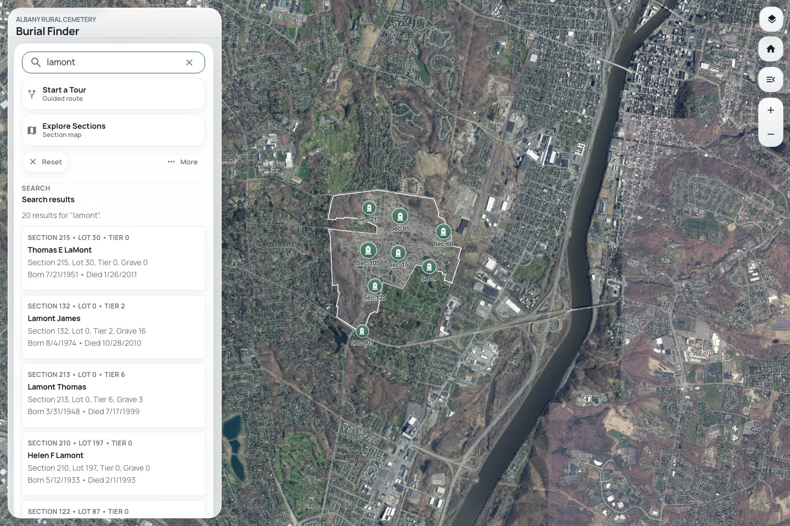
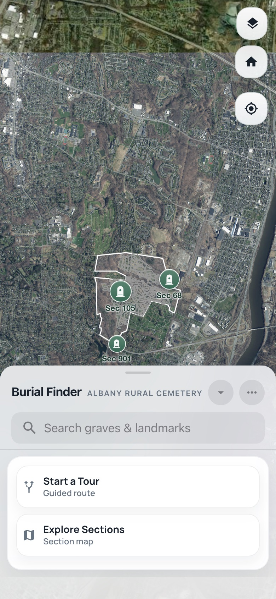

# FAB

## Quickstart

| Prerequisite | Source | Notes |
| --- | --- | --- |
| Bun 1.3.8 | `packageManager` in [package.json](./package.json) | Installs dependencies and runs package scripts. |
| Node 20 | [.nvmrc](./.nvmrc) | Runtime baseline for React, Jest, and build tooling. |
| Python 3 | System `python3` | Required for the local development image server. |
| `uv` and Python data tooling | Optional | Used by data download and GeoParquet workflows; not required for ordinary web development. |

```bash
bun install
bun run doctor
bun run start
```

FAB is the web application behind the Albany Rural Cemetery burial finder. It
is a React app and installable PWA for:

- searching burial records
- browsing the cemetery map by section or tour
- opening directions for on-site navigation
- sharing direct links that restore selections and map views
- restoring shared URLs and deep links

This repository owns the shared web experience. The same hosted URLs are used
directly on the web and inside `FABFG`, the native wrapper app.

## Product Snapshot





## Project layout

The product is split across three systems:

- `fab`: this repository, which owns the shared web app, data pipeline, map
  behavior, and deep-link handling
- `FABFG`: the native wrapper that loads hosted `fab` URLs in a native shell
- `albany.edu/arce`: the institutional production host for the promoted static
  build, along with some legacy content and image assets

Primary links:

- Source repository: [github.com/LaSarsoJackson/fab](https://github.com/LaSarsoJackson/fab)
- GitHub Pages deployment: [lasarsojackson.github.io/fab](https://lasarsojackson.github.io/fab/)
- Production site: [albany.edu/arce](https://www.albany.edu/arce/)
- Native wrapper repository: [github.com/LaSarsoJackson/FABFG](https://github.com/LaSarsoJackson/FABFG)
- iOS app: [Albany Grave Finder on the App Store](https://apps.apple.com/us/app/albany-grave-finder/id6746413050)

## Get started

### Requirements

- Node 20 from [.nvmrc](./.nvmrc)
- Bun 1.3.8 from `packageManager` in [package.json](./package.json)
- Python 3 for the local image server used in development

Optional tools:

- `uv` for Python data download scripts
- `geopandas`, `pyarrow`, and `shapely` for GeoParquet conversion and parity
  validation

### Install

```bash
bun install
```

### Configure local environment

Create a local `.env` file when you want to override the default image origin:

```bash
REACT_APP_DEV_IMAGE_SERVER_ORIGIN=http://127.0.0.1:8000
```

Notes:

- `Navigate` automatically hands far-away users to Apple Maps or Google Maps
  and starts bundled cemetery-road routing when the user is on site.
- External directions links are built from `src/shared/routing.js`; in-app
  cemetery routing still runs in the browser with no hosted routing API or
  local routing proxy.
- `bun run start` defaults `REACT_APP_DEV_IMAGE_SERVER_ORIGIN` to the local
  companion image server on `http://127.0.0.1:8000`.
- Development-only surfaces such as the static admin studio, custom renderer,
  PMTiles previews, and site-twin tools should stay on short-lived branches
  until they are ready for the shared `dev` pipeline; see
  [docs/dev-branch-workflow.md](./docs/dev-branch-workflow.md).

### Run the app

Start with the environment check:

```bash
bun run doctor
```

Then launch the development stack:

```bash
bun run start
```

This starts the React dev server, refreshes derived tour alias data, and serves
local images on `http://127.0.0.1:8000`.

Default local URL:

- [http://localhost:3000](http://localhost:3000)

Useful overrides:

- `FAB_SKIP_TOUR_DATA=1`: skip the alias refresh on restart
- `FAB_SKIP_IMAGE_SERVER=1`: skip the local image server
- `FAB_IMAGE_SERVER_PORT=9000`: run the image server on a different port
- `FAB_GEOSPATIAL_PYTHON=/path/to/python`: force a specific Python interpreter
  for geospatial tooling

## Common commands

- `bun run start`: start the development environment
- `bun run doctor`: check local prerequisites and optional tooling
- `bun run lint`: run the repository ESLint baseline across app, unit, and browser tests
- `bun run test`: run the default automated test suite
- `bun run check`: run `doctor`, `lint`, release metadata validation, and the default test suite
- `bun run release:check`: verify SemVer, changelog, and release tag metadata
- `bun run pr:check`: verify pull request branch policy when GitHub provides PR context
- `bun run build`: create a production build
- `bun run deploy`: create a local production build; GitHub Actions deploys
  `main`
- `bun run build:tour-data`: regenerate tour biography aliases
- `bun run build:basemaps`: refresh checked-in NYS ortho basemap images
- `bun run build:data`: regenerate search data, tour matches, and generated map
  bounds
- `bun run build:geoparquet`: convert the burial source JSON into GeoParquet
- `bun run validate:geoparquet`: verify GeoParquet parity with the JSON source

Test split:

- `bun run test:bun`: module and data tests
- `bun run test:dom`: React DOM and component tests
- `bun run test:e2e`: Playwright browser coverage
- `bun run smoke:mobile-pwa:ngrok`: optional production-build smoke server
  for checking real Mobile Safari install, standalone, and service-worker
  behavior through an HTTPS ngrok tunnel

## Which scripts are for me?

Most contributors usually need `bun run start`, `bun run test`, and
`bun run lint`. Run `bun run doctor` when setting up the repo or when a local
command fails unexpectedly.

Maintainer, data, and release work uses the more specialized commands:
`bun run check`, `bun run build:data`, `bun run build:tour-data`,
`bun run build:geoparquet`, `bun run validate:geoparquet`, `bun run build`,
`bun run release:check`, and the Playwright or mobile smoke commands when
release coverage is needed. Production deploys happen through GitHub Actions
after `staging` is promoted to `main`.

## Branches and Releases

Production work flows through three long-lived branches: `dev` for integration,
`staging` for pre-production validation, and `main` for production. Open
short-lived work branches into `dev`; when `dev` CI passes, GitHub Actions opens
or updates a `dev` -> `staging` PR and enables auto-merge. Promote `staging` to
`main` manually when ready for the public GitHub Pages/native-wrapper surface.
Short-lived branches should use prefixes such as `feature/`, `fix/`, `docs/`,
`chore/`, `hotfix/`, or `codex/`.

Versioned releases use SemVer in [`package.json`](./package.json), matching
entries in [`CHANGELOG.md`](./CHANGELOG.md), and tags named `vX.Y.Z`. See
[`docs/release-workflow.md`](./docs/release-workflow.md) for the full branch,
version, CI/CD, and GitHub branch-protection contract.

## Data pipeline

Source-of-truth data lives in:

- [`src/data/Geo_Burials.json`](./src/data/Geo_Burials.json)
- [`src/data/ARC_Sections.json`](./src/data/ARC_Sections.json)
- [`src/data/ARC_Roads.json`](./src/data/ARC_Roads.json)
- [`src/data/ARC_Boundary.json`](./src/data/ARC_Boundary.json)
- tour definitions and datasets in [`src/features/fab/tours.js`](./src/features/fab/tours.js)

Generated artifacts live in:

- [`src/data/TourBiographyAliases.json`](./src/data/TourBiographyAliases.json)
- [`src/data/TourMatches.json`](./src/data/TourMatches.json)
- [`public/data/Search_Burials.json`](./public/data/Search_Burials.json)
- [`src/features/map/generatedBounds.js`](./src/features/map/generatedBounds.js)

If you change source data, regenerate derived outputs instead of editing them by
hand:

```bash
bun run build:tour-data
bun run build:data
```

When `src/data/Geo_Burials.parquet` exists, the build pipeline prefers it and
falls back to `src/data/Geo_Burials.json` if the GeoParquet toolchain is not
available.

## Architecture notes

Start with these documents:

- [CONTRIBUTING.md](./CONTRIBUTING.md) for contributor workflow and validation
- [AGENTS.md](./AGENTS.md) for repo-specific automation and maintainer notes
- [docs/architecture-index.md](./docs/architecture-index.md) for a guide to the
  architecture notes
- [docs/codebase-structure.md](./docs/codebase-structure.md) for directory
  ownership and placement rules
- [docs/maintainability-playbook.md](./docs/maintainability-playbook.md) for
  repo-wide cleanup, comment policy, and source-of-truth boundaries
- [docs/routing-architecture.md](./docs/routing-architecture.md) for client
  route, deep-link, in-app road routing, and external directions-link ownership
- [docs/dev-branch-workflow.md](./docs/dev-branch-workflow.md) for the
  dev/staging/main branch workflow
- [docs/release-workflow.md](./docs/release-workflow.md) for production branch,
  versioning, release tags, and CI/CD rules

Common entry points:

- [`src/Map.jsx`](./src/Map.jsx): map orchestration, selections, overlays, and
  routing
- [`src/BurialSidebar.jsx`](./src/BurialSidebar.jsx): search, browse controls,
  selected record UI, and mobile drawer behavior
- [`src/features/browse/`](./src/features/browse): search indexing and browse
  result shaping
- [`src/features/tours/`](./src/features/tours): tour definitions, alias
  generation, and burial-tour reconciliation
- [`src/features/map/`](./src/features/map): popup models, selection reducer/actions,
  viewport helpers, and map-specific logic
- [`src/shared/routing.js`](./src/shared/routing.js): query keys and external
  Apple Maps / Google Maps directions links

## Deployment notes

There are two relevant hosted environments:

- GitHub Pages is the repo-controlled public web deployment. It is built and
  deployed by GitHub Actions after `staging` is manually promoted to `main`.
  The `gh-pages` branch is not part of the normal deployment path.
- `albany.edu/arce` is the institutional production deployment. Promotion to
  that host is still manual.

The app is served under `/fab` on GitHub Pages, so public asset URLs must honor
`process.env.PUBLIC_URL`. If a data fetch returns `<!DOCTYPE html>`, check the
requested path first.

Because `FABFG` consumes hosted `fab` URLs, any change to shared routing,
selection state, or deep links should be checked in both the web app and the
native wrapper.

## Contributing

Contributions are welcome. Start with [CONTRIBUTING.md](./CONTRIBUTING.md) for
setup, validation expectations, and pull request guidance.
