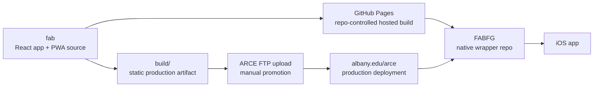

# FAB (`fab`)

`fab` is the main web application for the Albany Rural Cemetery burial-finder experience. It is a React app and installable PWA that provides:

- burial search
- map browsing by section and tour
- on-site navigation and directions
- deep links used by the hosted web app and the native wrapper

This repository is the core product surface. If the map, search, tours, routing, or shared UI are wrong, the fix usually starts here.

## Relationship To The Other Projects

There are three systems to keep straight:

1. `fab`
   This repo. It owns the shared web experience, data pipeline, map behavior, deep links, and PWA shell.
2. `FABFG`
   A separate native wrapper app that loads hosted `fab` URLs inside a native shell.
3. `albany.edu/arce`
   The institutional production host for the promoted static build, plus a source of some legacy content and image assets.

Primary links:

- Source repo: [github.com/LaSarsoJackson/fab](https://github.com/LaSarsoJackson/fab)
- GitHub Pages deploy: [lasarsojackson.github.io/fab](https://lasarsojackson.github.io/fab/)
- Production site: [albany.edu/arce](https://www.albany.edu/arce/)
- Native wrapper repo: [github.com/LaSarsoJackson/FABFG](https://github.com/LaSarsoJackson/FABFG)
- iOS app: [Albany Grave Finder on the App Store](https://apps.apple.com/us/app/albany-grave-finder/id6746413050)

How they fit together:



Practical rule of thumb:

- Change `fab` for map/search/tour/deep-link/PWA work.
- Change `FABFG` for native tabs, packaging, or wrapper-level behavior.
- Change ARCE content separately when the issue is a legacy page, hosted image, or institutional content asset.

## Get Started

### Prerequisites

- Node `>= 20` from [.nvmrc](./.nvmrc)
- Bun `>= 1.3`
- Python 3 for the local image server used in development
- Optional Python geospatial packages (`geopandas`, `pyarrow`, `shapely`) for GeoParquet conversion and parity validation
- Optional `tippecanoe` for PMTiles generation
- Optional GraphHopper API key if you need full routing behavior locally

GeoParquet note:

- the repo will auto-detect a Python interpreter with `geopandas`, `pyarrow`, and `shapely`
- on this machine, that currently resolves to `/opt/anaconda3/bin/python`
- set `FAB_GEOSPATIAL_PYTHON=/path/to/python` if you want to force a specific interpreter or repo-local virtualenv

### Install

Recommended:

```bash
bun install
```

Fallback:

```bash
npm install
```

### Configure Local Environment

Create a local `.env` file when you need routing or want to override the default local image origin:

```bash
REACT_APP_GRAPHHOPPER_API_KEY=your_key_here
REACT_APP_DEV_IMAGE_SERVER_ORIGIN=http://127.0.0.1:8000
```

Notes:

- Routing will be limited without `REACT_APP_GRAPHHOPPER_API_KEY`.
- `bun run start` defaults `REACT_APP_DEV_IMAGE_SERVER_ORIGIN` to the companion image server on `http://127.0.0.1:8000`.
- Set `REACT_APP_DEV_IMAGE_SERVER_ORIGIN` only when you need a different image host.

### Run The App

Recommended:

```bash
bun run start
```

Fallback:

```bash
npm run start
```

This starts:

- the derived tour biography-alias refresh used by popup/link normalization
- the React dev server
- the local image server on `http://127.0.0.1:8000`
- the app in development mode with `REACT_APP_ENVIRONMENT=development`

Default local URL:

- [http://localhost:3000](http://localhost:3000)

Useful overrides:

- `FAB_SKIP_TOUR_DATA=1`: skip the tour biography-alias refresh on restart
- `FAB_SKIP_IMAGE_SERVER=1`: skip the local image server when you are using a different image origin
- `FAB_IMAGE_SERVER_PORT=9000`: run the companion image server on a different port

### Most Important Developer Commands

Regenerate derived data after changing source cemetery data:

```bash
bun run build:data
```

Generate the optional GeoParquet source artifact used by the build pipeline:

```bash
bun run build:geoparquet
```

Validate that GeoParquet remains a 1:1 build-time replacement for GeoJSON:

```bash
bun run validate:geoparquet
```

This expects a generated `src/data/Geo_Burials.parquet` file plus the optional
Python geospatial dependencies above. The scripts will auto-detect a working
interpreter, or you can override it with `FAB_GEOSPATIAL_PYTHON`.

Describe the current application-specific engine surface:

```bash
bun run describe:map-engine
```

Check local prerequisites and optional env setup:

```bash
bun run doctor
```

Run tests:

```bash
bun run test
```

Run the full local safety check:

```bash
bun run check
```

Test split:

- `bun run test`: Bun module tests plus Jest DOM tests
- `bun run test:bun`: pure module/data tests
- `bun run test:dom`: React DOM and component tests
- `bun run test:e2e`: Playwright browser coverage
- `bun run test:watch` / `bun run test:coverage`: Bun watch/coverage helpers

Create a production build:

```bash
bun run build
```

Deploy the GitHub Pages version:

```bash
bun run deploy
```

### Maintainer Docs

Read these before making structural changes:

- [CONTRIBUTING.md](./CONTRIBUTING.md): contributor workflow, review expectations, and area-specific checklists
- [AGENTS.md](./AGENTS.md): quick maintainer and automation guide
- [docs/architecture-index.md](./docs/architecture-index.md): which architecture note to read for which task
- [docs/codebase-structure.md](./docs/codebase-structure.md): folder ownership and placement rules
- [docs/map-architecture.md](./docs/map-architecture.md): `Map.jsx` boundary and refactor guidance
- [docs/custom-map-engine.md](./docs/custom-map-engine.md): what qualifies as FAB's custom map engine
- [docs/map-engine-api.md](./docs/map-engine-api.md): engine runtime contract and data backend API
- [docs/map-engine-fab-spec.md](./docs/map-engine-fab-spec.md): application-specific engine requirements and capability boundaries
- [docs/map-engine-geoparquet.md](./docs/map-engine-geoparquet.md): GeoParquet migration and static optimization strategy
- [docs/static-admin-studio.md](./docs/static-admin-studio.md): admin workspace flow and packaging rules
- [docs/app-profile-architecture.md](./docs/app-profile-architecture.md): active profile wiring and FAB-specific boundaries
- [docs/ui-principles.md](./docs/ui-principles.md): Apple-HIG-inspired UI rules for FAB surfaces
- [docs/unified-stack-roadmap.md](./docs/unified-stack-roadmap.md): staged plan for web/native unification and custom map work

## How The Project Works

### Runtime Model

At runtime, `fab` is a client-side React app centered around [src/Map.jsx](./src/Map.jsx).

For maintainers, see [docs/map-architecture.md](./docs/map-architecture.md) for the intended boundary between `Map.jsx` and the extracted map support modules.

Import boundary:

- `src/features/*` groups domain-specific logic by product area
- `src/shared/*` holds generic helpers that are not specific to browse, tours, or map UI
- top-level app files should depend on those grouped entry points instead of reaching into one flat helper directory

The main flows are:

- load a lightweight burial search index
- harmonize those burial records with precomputed tour matches
- lazily build the client-side search index
- render map overlays, section browsing, selected markers, and tours
- open directions and deep links from the same shared record model

Key point:

- marker clusters are the default and canonical rendering path for burial browsing
- the app owns a runtime contract and custom renderer path instead of treating Leaflet as the only engine API
- Leaflet remains a compatibility adapter and rollback path while the custom runtime grows
- PMTiles is not the default map mode, including in development
- PMTiles is only available as an explicit dev toggle from the in-app menu for experimentation and validation
- the dev PMTiles experiment uses semi-transparent semantic glyphs plus small deterministic offsets so stacked burials remain readable without replacing the clustered UX
- GeoParquet is the preferred future build-time source format, but migration is designed to stay invisible to users by preserving the same runtime artifacts

### Data Pipeline

The app does not do its heaviest data work on every page load anymore.

Source-of-truth data lives in:

- `src/data/Geo_Burials.json`
- `src/data/ARC_Sections.json`
- `src/data/ARC_Roads.json`
- the tour definition modules in `src/features/tours/tourDefinitions.js`

Optional build-time canonical data can also live in:

- `src/data/Geo_Burials.parquet`

Generated artifacts live in:

- `public/data/Search_Burials.json`
- `public/data/geo_burials.pmtiles`
- `src/data/TourBiographyAliases.json`
- `src/data/TourMatches.json`
- `src/features/map/generatedBounds.js`

`bun run build:tour-data` is the lightweight popup-data refresh. It runs [scripts/generate-tour-biography-aliases.js](./scripts/generate-tour-biography-aliases.js), which:

1. loads every bundled tour dataset
2. builds deterministic biography aliases for fixed-format tours
3. writes `src/data/TourBiographyAliases.json`

`bun run build:data` is the full derived-data rebuild. It runs the popup-data refresh first, then runs [scripts/precalculate-metadata.js](./scripts/precalculate-metadata.js), which:

1. loads the burial source data
2. loads tour data
3. matches tour stops against burial records
4. writes the minified search index used by the client
5. writes static bounds/constants used by the app

When `src/data/Geo_Burials.parquet` exists, the derived-data build now prefers
that GeoParquet source and falls back to `src/data/Geo_Burials.json` if the
GeoParquet toolchain is unavailable.

`bun run build:geoparquet` runs
[scripts/migrations/geoparquet/generate_geoparquet.sh](./scripts/migrations/geoparquet/generate_geoparquet.sh),
which attempts to convert `src/data/Geo_Burials.json` into
`src/data/Geo_Burials.parquet` without changing the runtime API.

If you change source cemetery data and do not regenerate these files, the app can behave inconsistently.
The dev and production build wrappers now regenerate the tour alias file automatically, and the test suite checks that the checked-in alias file is still in sync with the source tour datasets.

### Map Rendering Model

The map has a few distinct rendering paths:

- a renderer-neutral runtime contract with both custom and Leaflet implementations
- section polygons
- roads and cemetery boundary overlays
- selected/pinned burial markers
- section-level clustered burial markers when section browsing is active
- lazily loaded tour layers
- optional PMTiles experiment in development only

The intended behavior is:

- app orchestration talks to the FAB runtime contract, not directly to Leaflet
- browsing a section uses the marker-cluster path
- selecting from search, section, or tour should resolve to the same burial record shape
- a selection should focus and behave the same regardless of where in the UI it started

If you change selection logic, validate all of these:

- search result click
- selected-person card click
- section polygon click
- section marker click
- tour stop click
- deep-link selection

### Tours

Tours are defined through [src/features/tours/tourDefinitions.js](./src/features/tours/tourDefinitions.js) and loaded lazily. The app:

- loads tour GeoJSON only when needed
- precomputes cross-links between burial records and tour records
- normalizes tour browse results into the same UI model used elsewhere

That means a tour stop and a burial record should feel like the same object from the UI’s point of view, even if they came from different datasets.

Tour popup normalization is documented in [docs/tour-popup-data.md](./docs/tour-popup-data.md).

### Public Asset Paths

This app is deployed under `/fab` on GitHub Pages, so public assets must be loaded via `process.env.PUBLIC_URL` rather than raw `/data/...` absolute paths.

If you see JSON requests returning `<!DOCTYPE html>`, check whether a data file was accidentally fetched from the wrong base path.

## Repo Tour

Start here when you are orienting yourself:

- [src/Map.jsx](./src/Map.jsx): main app shell, map orchestration, selections, tours, routing, overlays
- [docs/map-architecture.md](./docs/map-architecture.md): maintainer notes for where map logic should live
- [docs/custom-map-engine.md](./docs/custom-map-engine.md): custom engine ownership, runtime split, and product-level definition
- [docs/map-engine-api.md](./docs/map-engine-api.md): engine runtime contract and data backend API
- [docs/map-engine-fab-spec.md](./docs/map-engine-fab-spec.md): FAB-specific engine requirements, shipped flows, and adapter boundaries
- [docs/map-engine-geoparquet.md](./docs/map-engine-geoparquet.md): GeoParquet migration strategy and format roles
- [AGENTS.md](./AGENTS.md): quick-maintenance checklist for agents and contributors
- [docs/codebase-structure.md](./docs/codebase-structure.md): directory responsibilities and placement guide
- [src/BurialSidebar.jsx](./src/BurialSidebar.jsx): search UI, browse controls, mobile drawer, selected/results panels
- [docs/static-admin-studio.md](./docs/static-admin-studio.md): admin workspace and update-bundle workflow
- [src/features/browse/](./src/features/browse): indexing, search helpers, and browse result shaping
- [src/features/tours/](./src/features/tours): tour definitions, alias generation, and burial-tour reconciliation
- [src/features/map/](./src/features/map): popup view-models, selection helpers, viewport helpers, and generated bounds
- [src/features/deeplinks/](./src/features/deeplinks): field packets and deep-link state parsing
- [src/shared/geo/](./src/shared/geo): generic GeoJSON helpers
- [src/shared/runtime/](./src/shared/runtime): environment and feature-flag helpers
- [docs/app-profile-architecture.md](./docs/app-profile-architecture.md): profile registry and FAB-specific feature boundaries
- [docs/tour-popup-data.md](./docs/tour-popup-data.md): end-to-end tour popup data flow and change guide
- [src/features/map/generatedBounds.js](./src/features/map/generatedBounds.js): generated map bounds and related constants
- [src/data/](./src/data/): local GeoJSON and generated metadata used at build/runtime
- [src/data/TourBiographyAliases.json](./src/data/TourBiographyAliases.json): generated alias map used to recover biography slugs for fixed-format tours
- [public/data/Search_Burials.json](./public/data/Search_Burials.json): generated lightweight search payload
- [scripts/precalculate-metadata.js](./scripts/precalculate-metadata.js): data generation script
- [scripts/generate-tour-biography-aliases.js](./scripts/generate-tour-biography-aliases.js): derived tour popup data generation
- [scripts/dev-start.sh](./scripts/dev-start.sh): development startup wrapper
- [scripts/build-production.sh](./scripts/build-production.sh): production build wrapper
- [scripts/deploy-production.sh](./scripts/deploy-production.sh): GitHub Pages deploy wrapper

## Development Workflow

### Common Change Types

If you change source data:

1. edit the relevant files in `src/data/`
2. run `bun run build:tour-data` if you changed tour data used by popups
3. run `bun run build:data` if you changed source data that feeds search, tour matching, or generated bounds
4. avoid hand-editing generated outputs unless you are regenerating them in the same change
5. test search, section browse, and tours

If you change map UI or selection behavior:

1. test desktop and mobile
2. test section browse and tour flows
3. test that selected markers and popups still match the clicked record
4. test any relevant deep-link restore flow

If you change anything under `public/` or public data fetching:

1. verify it still works under `localhost`
2. verify it still works under the `/fab` GitHub Pages base path

If you change the admin workspace:

1. test `#/admin` locally
2. verify workbook import/export for the touched module type
3. verify the update bundle still regenerates the expected derived artifacts

### Mobile Drawer Expectations

The mobile sidebar is a bottom drawer, not a desktop card squeezed onto a phone screen.

The intended model is:

- collapsed: minimal search shell
- peek: search plus browse controls
- full: selected people and results work area

If you touch `src/BurialSidebar.jsx` or related CSS, validate that the drawer still behaves like a drawer and not just a styled panel.

### Dev vs Production

Environment mode is driven by `REACT_APP_ENVIRONMENT`.

- `scripts/dev-start.sh` starts the app as `development`
- `scripts/build-production.sh` builds as `production`
- `scripts/deploy-production.sh` always deploys the production build

Production should not expose developer-only chrome. Development can show lightweight dev context where it helps.

## Deployment

The deployment flow is intentionally split into two environments.

### 1. GitHub Pages

Use this for repo-controlled public validation:

```bash
bun run deploy
```

This runs the production build and publishes `build/` to GitHub Pages.

### 2. ARCE Production

This repo does not currently automate the institutional production publish.

Current flow:

1. build and validate the release candidate
2. publish to GitHub Pages for validation
3. promote the approved static build from `build/`
4. upload the static files to the ARCE FTP host

Important:

- GitHub Pages is the easiest public validation target
- ARCE is the real production deployment
- a change here can affect both the hosted web app and the native wrapper app

## Deep Links And Wrapper Integration

The native wrapper and shared URLs depend on query-driven state in `fab`.

Important patterns include:

- `?view=burials`
- `?view=tours`
- `?section=<value>`
- `?tour=<name fragment>`
- `?q=<search text>`

If you change deep-link handling, verify whether `FABFG` needs a corresponding update.

## Troubleshooting

### Burial data fails to load and JSON parsing complains about HTML

Usually means a public asset path is wrong for the current host base path. Check any `fetch()` or static asset URL that starts with `/`.

### Tours or search results do not match the right burial record

Regenerate derived data with:

```bash
bun run build:data
```

Then retest the selection flow from:

- search
- section browse
- tours
- deep links

### A change works on the web but not in the iOS app

Decide whether the problem is:

- the shared hosted experience in `fab`
- the native shell behavior in `FABFG`
- an external ARCE-hosted content dependency
