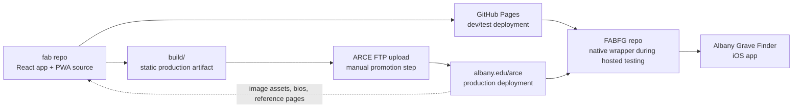

# FAB (`fab`)

`fab` is the source repository for the Albany Rural Cemetery burial-finder experience. It is a React-based web app and installable PWA that gives visitors a map, burial search, tours, and on-site navigation.

If you are new to the project, the shortest accurate summary is:

- `fab` is the main product.
- `FABFG` is a native wrapper around hosted `fab`.
- The iOS app ships that wrapper.
- GitHub Pages is the repo-controlled test deployment for `fab`.
- `albany.edu/arce` is the institutional production deployment, promoted from `fab` build artifacts.

Primary links:

- Source repo: [github.com/LaSarsoJackson/fab](https://github.com/LaSarsoJackson/fab)
- Hosted dev/test target: [lasarsojackson.github.io/fab](https://lasarsojackson.github.io/fab/)
- Production site: [albany.edu/arce](https://www.albany.edu/arce/)
- Native wrapper repo: [github.com/LaSarsoJackson/FABFG](https://github.com/LaSarsoJackson/FABFG)
- iOS app: [Albany Grave Finder on the App Store](https://apps.apple.com/us/app/albany-grave-finder/id6746413050)

## How The Pieces Fit Together



In practice:

- Work on `fab` when you need to change the map, burial search, tours, deep links, PWA behavior, or shared UX.
- Work on `FABFG` when you need to change native tabs, Expo configuration, app packaging, or which hosted `fab` URL the app loads.
- Work outside this repo when you need to change legacy biography pages, image assets, or other institutional web content hosted at `albany.edu/arce`.
- Treat GitHub Pages as the fast public validation target, and ARCE as the final promoted production host.

## What This Repo Owns

This repo is the underlying development target for the project. It owns the shared browser experience that is:

- run locally during development
- deployed to GitHub Pages for repo-controlled testing
- built into static files for production promotion
- uploaded to ARCE hosting through FTP for the institutional deployment
- reused by `FABFG` as the hosted experience inside the native app shell

That means many issues reported as "the iPhone app is wrong" still need to be fixed here first, because the app usually displays `fab`, not a separate native reimplementation of the map and search flow.

## What Lives In The Other Systems

### `FABFG`

`FABFG` is a companion Expo app that wraps hosted `fab` URLs in native tabs/webviews. Depending on the release stage, that hosted target may be the GitHub Pages test deployment or the promoted ARCE production deployment. It uses deep links such as:

- base URL for the main experience
- `?view=burials`
- `?view=tours`

So the relationship is:

1. `fab` provides the hosted web experience.
2. GitHub Pages is used to test that hosted experience publicly.
3. The validated static build is uploaded to ARCE via FTP for production.
4. `FABFG` points native tabs at the hosted experience appropriate for the environment.
5. The iOS app distributes `FABFG` through the App Store.

### `albany.edu/arce`

`albany.edu/arce` is both:

- a public production-facing institutional site
- a legacy content source that `fab` still depends on in places

Today, parts of `fab` still link to ARCE-hosted biographies and image assets. It is also the final production host for the promoted static build generated from this repo. That is important operationally: a change in this repo can affect the shared app shell, but some content still lives elsewhere.

## Tech Stack

- React 17 with `react-scripts`
- Bun-first package management, with npm fallback
- Leaflet + Esri basemap integrations for map rendering
- Local JSON / GeoJSON datasets under `src/data`
- PWA manifest + service worker in `public/`

## Repo Tour

Start here if you are trying to understand the codebase:

- `src/Map.jsx`: main application shell, map behavior, search results, tours, routing, and external ARCE links
- `src/lib/burialSearch.js`: burial indexing, normalization, and search logic
- `src/lib/urlState.js`: deep-link parsing for views, sections, tours, and queries
- `src/lib/navigationLinks.js`: direction / navigation link helpers
- `src/data/`: cemetery boundary, roads, sections, burials, tours, and image assets
- `public/manifest.json`: PWA metadata
- `public/service-worker.js`: offline/static asset caching
- `docs/arce-content-upgrade-plan.md`: cross-repo notes about the relationship between `fab`, `FABFG`, and ARCE content

## Quick Start

### Prerequisites

- Node `>= 20` from [.nvmrc](./.nvmrc)
- Bun `>= 1.3`
- Optional GraphHopper API key for routing

### Install

Recommended:

```bash
bun install
```

Fallback:

```bash
npm install
```

### Configure Environment

Routing uses GraphHopper. If you need turn-by-turn walking routes in development, add a local `.env` file with:

```bash
REACT_APP_GRAPHHOPPER_API_KEY=your_key_here
```

Without that key, most of the app still works, but route calculation will not.

### Run Locally

Recommended:

```bash
bun run start
```

Fallback:

```bash
npm run start
```

The app runs on [http://localhost:3000](http://localhost:3000).

## Day-To-Day Commands

Run tests:

```bash
bun test
```

Create a production build:

```bash
bun run build
```

Publish the repo-controlled hosted version to GitHub Pages:

```bash
bun run deploy
```

## Deployment Flow

The intended release path for this project is:

1. Develop and test changes locally in `fab`.
2. Build and publish `fab` to GitHub Pages with `bun run deploy`.
3. Use the GitHub Pages URL as the public dev/test environment for browser and hosted-wrapper validation.
4. When that version is approved, treat the generated static site in `build/` as the production artifact.
5. Upload those static files to the ARCE hosting environment over FTP.
6. ARCE then becomes the public production deployment of that `fab` build.

Important detail:

- This repo automates the GitHub Pages deploy.
- This repo does not currently automate the ARCE FTP publish.
- The ARCE promotion step is a manual handoff of the built static files.

## Deep Links

These query parameters matter because the native wrapper and shared links depend on them:

- `?view=burials`
- `?view=tours`
- `?section=<value>`
- `?tour=<name fragment>`
- `?q=<search text>`

When you change view or navigation behavior here, check whether `FABFG` also needs an update.

## Where To Make A Change

Use this as a rule of thumb:

| If you need to change... | Start here |
| --- | --- |
| map behavior, burial search, tours, PWA shell, deep links | `fab` |
| native tab layout, Expo config, app icons, app packaging | `FABFG` |
| GitHub Pages test deployment | `fab` |
| production static files that will be uploaded to ARCE FTP | `fab` |
| hosted app URL loaded by the wrapper | `FABFG`, after validating which hosted `fab` environment should be used |
| biographies, legacy pages, ARCE-hosted images/content | `albany.edu/arce` content pipeline, outside this repo |

## Suggested Workflow For New Contributors

1. Make the shared experience change in `fab`.
2. Run it locally and test the relevant deep link.
3. Deploy to GitHub Pages and smoke-test the hosted version there.
4. If approved for release, build or reuse the validated static output and upload it to ARCE via FTP.
5. If the change affects native tabs or hosted URL wiring, update `FABFG`.
6. If the feature touches biographies or legacy image assets, validate that the ARCE content it depends on still exists.

## Operational Notes

- GitHub Pages is the easiest public environment for validating a candidate `fab` build before production promotion.
- ARCE production is the result of uploading the built static site to the institutional FTP host.
- A bug in `fab` can affect both the web experience and the iOS app because the iOS app is usually loading this hosted web app.
- A bug in `FABFG` is more likely to be about native shell behavior than cemetery data, map logic, or search behavior.
- A bug involving missing biographies or images may be outside this repo if the broken asset is hosted on `albany.edu/arce`.

## Related Project Context

See [docs/arce-content-upgrade-plan.md](./docs/arce-content-upgrade-plan.md) for the current migration direction between:

- the legacy ARCE web presence
- the `fab` PWA
- the `FABFG` native wrapper
