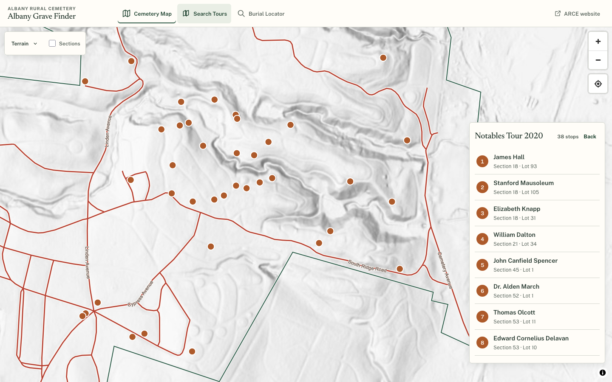
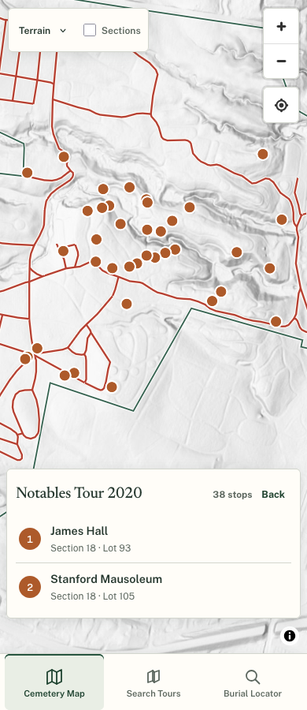

# Albany Rural Cemetery Grave Finder

Find a burial, locate it on the cemetery map, or explore Albany Rural Cemetery through a curated tour. The app combines burial records with cemetery roads, sections, and historic information.

[Open the map](https://lasarsojackson.github.io/fab/) · [Search burial records](https://lasarsojackson.github.io/fab/?view=burials) · [Browse tours](https://lasarsojackson.github.io/fab/?view=tours)





Screenshots use a synthetic location for development.

## Using the app

**Cemetery Map** opens by default. Select a section or a grave to see its location. **Burial Locator** searches the burial index. **Search Tours** opens curated stops with their history and map locations.

Burial Locator accepts a name, section, lot, or tier in any combination. Lot and
tier filters match whole identifiers, including letters and punctuation. **Show more results** makes
later matches available in groups of 80. Search filters stay in the URL when you
reload or open a grave and return to the locator.

Choose Terrain, Streets, or Aerial in Map layers. Terrain uses Esri World Hillshade; Streets uses OpenStreetMap; Aerial uses New York State orthoimagery. Cemetery roads, sections, and selected graves appear above the background. Map credits remain available beside Help.

## Directions on site

Choose **Directions** on a selected grave or the map. The **From** and **To**
rows let you search for a section or burial, or choose a point on the map.
**Use my location** updates the road route as you move. **Stop following** ends those updates. Using location switches
the map to bundled local data and stops requests to external tile providers until
the app reloads. The app also stops its location watch when the map is hidden.
Position fixes stay on the device unless you choose **Open in Maps**.

Routes use the bundled cemetery-road data. Dashed connectors show gaps to those
roads, not mapped paths. Check signs and access on site; the app does not confirm
closures, path conditions, or accessible routes. Keyboard users can choose a
place from the list or pan the map and confirm its crosshair point.

## Run locally

Use Node.js 22.12 or newer and Bun. The pinned Bun version is in `package.json`.

```bash
bun install
bun run doctor
bun run start
```

Open [localhost:5173/fab](http://localhost:5173/fab/). The app uses React, Vite, and MapLibre GL JS. It does not need a backend or a geospatial Python environment.

## Data and maps

Burial records are stored in [`src/data/Geo_Burials.json`](src/data/Geo_Burials.json). The browser searches a smaller generated index in a Web Worker. Roads, sections, and the cemetery boundary use the GeoJSON files in `src/data/`.

After updating source records or tour data, regenerate the browser files:

```bash
bun run build:data
```

See [Contributing](CONTRIBUTING.md) for data checks and [Cartography](docs/cartography.md) for the map design and attribution.

## Development

```bash
bun run lint
bun run test
bun run build
bun run test:e2e
```

`bun run check` runs the local release checks. The [architecture guide](docs/architecture-index.md) covers the map, search, tours, and shared links.

Shared links use `q`, `section`, `lot`, `tier`, `tour`, and `record`. Old packed `share` links remain readable; new links identify canonical records.

The [FABFG repository](https://github.com/LaSarsoJackson/FABFG) contains the native mobile app that displays these hosted pages. Its embedded routes use `embed=fabfg` so the mobile app supplies the navigation. See the [routing guide](docs/routing-architecture.md) for URL parameters and deep links.

## Hosting

GitHub Pages publishes the app at `/fab/` and the ARCE website and guides at
[/fab/arce/](https://lasarsojackson.github.io/fab/arce/) from `main` after checks
pass. The website opens its matching app at `/fab/arce/app/`; both app entries
return to the GitHub-hosted ARCE site. `bun run build:pages` builds the complete
Pages artifact. University publishing uses a separate SFTP deployment. Native
app releases are managed in FABFG.

The ARCE website source and current visitor guides are under `arce/`.
`bun run build:arce` prepares the website at `/arce/dev/` and the app at
`/arce/dev/app/`, with a file manifest. The app returns to the matching website
in the same tab. Run `bun run check:arce` and `bun run test:arce` before publishing.
Use the explicit `production` target for a later `/arce/` package. See the
[ARCE upload procedure](docs/arce-upload-instructions.md) for backups, upload
order, preservation of existing biographies and Grave Finder, and rollback.
