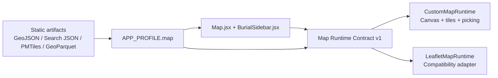

# Custom Map Engine

This repo now has an internal map-engine boundary that the app owns.

That matters because the product can accurately describe the map stack as a
custom engine instead of "Leaflet with a few patches." App code depends on our
runtime contract, our source model, our profile-driven basemap registry, and
our custom canvas renderer. Leaflet remains a compatibility adapter and rollback
path, not the architectural center of the product.

Documentation posture:

- the engine contract is documented as an engine-owned API
- Leaflet public references inform compatibility goals
- the contract and implementation notes should stay clean-roomed from private upstream internals

## What Counts As The Engine

The engine is the combination of:

- the runtime contract in [`src/features/map/engine/contracts.js`](../src/features/map/engine/contracts.js)
- the standalone-oriented entry point in [`src/features/map/engine/standalone.js`](../src/features/map/engine/standalone.js)
- the backend contract in [`src/features/map/engine/backend.js`](../src/features/map/engine/backend.js)
- the app-specific manifest in [`src/features/map/engine/manifest.js`](../src/features/map/engine/manifest.js)
- the custom renderer in [`src/features/map/engine/customRuntime.js`](../src/features/map/engine/customRuntime.js)
- the React bridge in [`src/features/map/engine/CustomMapSurface.jsx`](../src/features/map/engine/CustomMapSurface.jsx)
- the compatibility adapter in [`src/features/map/engine/leafletRuntime.js`](../src/features/map/engine/leafletRuntime.js)
- the profile-driven basemap and overlay registry in [`src/features/fab/profile.js`](../src/features/fab/profile.js)
- the build-time data backend in [`scripts/geospatial/load_burial_source.js`](../scripts/geospatial/load_burial_source.js) and [`scripts/precalculate-metadata.js`](../scripts/precalculate-metadata.js)
- the GeoParquet parity guard in [`scripts/geospatial/validate_burial_source_parity.js`](../scripts/geospatial/validate_burial_source_parity.js)
- the orchestration layer in [`src/Map.jsx`](../src/Map.jsx)

## Current Position

The current runtime API version is `1`.
The current engine manifest version is `1`.

Today the engine supports:

- camera state, bounds fitting, pan/zoom, and viewport helpers
- raster XYZ basemaps
- PMTiles/vector-tile basemap declarations with raster fallback
- GeoJSON polygon and line overlays
- bounded raster image overlays
- point rendering, deterministic screen-space clustering, and hit testing
- popup anchoring and selection synchronization
- a shared Leaflet adapter so the same app orchestration can target either runtime

Leaflet still carries the production-default behavior and rollback coverage.
The custom runtime now has verified parity for FAB's core search, browse, deep
link, route-on-map, locate, and mobile selection flows, and remains behind the
feature flag for rollout control rather than because those flows are missing.

## Ownership Model

Use this split when editing:

- [`src/Map.jsx`](../src/Map.jsx): selection, routing state, deep links, popup view-model scheduling, and runtime selection
- [`src/features/map/engine/`](../src/features/map/engine): rendering, camera math, picking, tile management, and renderer-neutral contracts
- [`src/features/fab/profile.js`](../src/features/fab/profile.js): what the engine is allowed to load and which static artifacts exist
- [`scripts/`](../scripts): build-time transforms that turn source data into runtime artifacts

Do not let renderer-specific Leaflet behavior leak back into the shared app
layer. That is the main thing that would undermine the "custom engine" claim.
At the same time, do not document the custom runtime as the current production
baseline until the default-runtime decision actually changes.

## Architectural Shape

## Why GeoParquet Matters Here

The engine should not be tied to GeoJSON as the only source-of-truth format.
GeoJSON is still a useful checked-in fallback and editing format, but the
long-term static-optimization path is:

- GeoParquet as the preferred build-time source
- PMTiles as the preferred browser delivery format for vector-heavy overlays
- minified JSON as the preferred search payload

That migration is documented in:

- [`docs/map-engine-api.md`](./map-engine-api.md)
- [`docs/map-engine-standalone-api.md`](./map-engine-standalone-api.md)
- [`docs/map-engine-fab-spec.md`](./map-engine-fab-spec.md)
- [`docs/map-engine-geoparquet.md`](./map-engine-geoparquet.md)

## Claims We Can Make

These are accurate statements about the current architecture:

- FAB owns its own map runtime contract and runtime selection.
- FAB ships a custom map renderer behind that contract.
- Leaflet remains the production-default adapter and rollback path while the custom runtime stays feature-flagged for rollout control.
- The engine’s basemap, overlay, and optimization-artifact registry is profile-driven.
- The static data pipeline can prefer GeoParquet without changing the user-facing map behavior.
