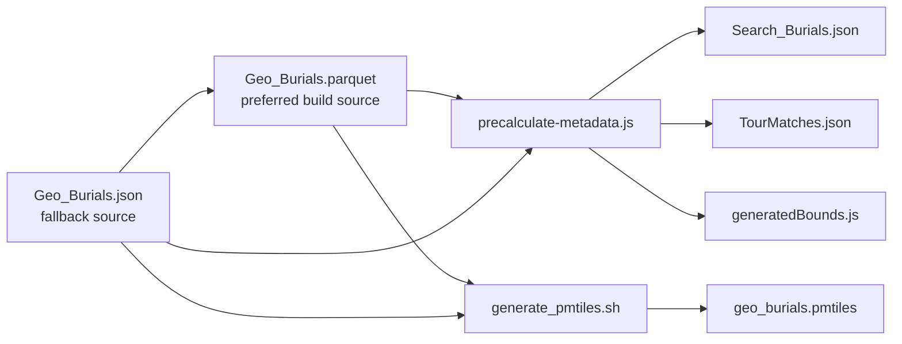

# GeoParquet Migration For The Map Engine

This is the target data-format strategy for the custom map engine.

The goal is not to expose GeoParquet directly to users. The goal is to let the
build pipeline prefer GeoParquet as a 1:1 source replacement while the runtime
keeps receiving the same app-facing artifacts and record model.

## Desired Outcome

The same burial record should be able to originate from either:

- `src/data/Geo_Burials.json`
- `src/data/Geo_Burials.parquet`

and still produce the same:

- `public/data/Search_Burials.json`
- `src/data/TourMatches.json`
- `src/features/map/generatedBounds.js`
- `public/data/geo_burials.pmtiles`

If those outputs stay stable, the user never sees the source-format swap.

## Why GeoParquet

GeoParquet is the right target build format because it aligns with the current
cloud-native geospatial toolchain:

- the GeoParquet `1.1.0` spec allows geometry columns to be encoded as WKB or
  single-geometry GeoArrow encodings and requires explicit geospatial metadata
  in Parquet file metadata
- the spec recommends `.parquet` as the file extension for interoperability
- DuckDB can read GeoParquet through normal Parquet scans and convert geometry
  columns to `GEOMETRY` when the spatial extension is loaded
- DuckDB’s geospatial stack is moving toward first-class geometry support in the
  broader Parquet ecosystem

Primary references:

- [GeoParquet 1.1.0 specification](https://geoparquet.org/releases/v1.1.0/)
- [DuckDB spatial extension overview](https://duckdb.org/docs/lts/core_extensions/spatial/overview.html)
- [DuckDB 1.1.0 GeoParquet announcement](https://duckdb.org/2024/09/09/announcing-duckdb-110.html)
- [Protomaps / PMTiles overview](https://docs.protomaps.com/)
- [Creating PMTiles](https://docs.protomaps.com/pmtiles/create)

## Format Roles

Use the formats for different jobs:

- GeoJSON
  Human-readable fallback and easiest checked-in editing format.
- GeoParquet
  Preferred build-time source and static optimization format.
- PMTiles
  Preferred browser delivery format for vector-heavy overlays.
- Minified JSON
  Preferred search payload for client-side browse and fuzzy search.

## Current Repo Support

The repo now supports this migration path:

1. Generate GeoParquet from GeoJSON:
   `bun run build:geoparquet`
2. Run the normal derived-data build:
   `bun run build:data`
3. The build loader will prefer `src/data/Geo_Burials.parquet` when it exists.
4. If GeoParquet dependencies are missing or the file is absent, the pipeline
   falls back to `src/data/Geo_Burials.json`.

The GeoParquet migration helpers currently expect Python geospatial packages
such as `geopandas`, `pyarrow`, and `shapely`.

The repo now auto-detects a Python interpreter with that stack when running the
GeoParquet helpers. If you want to force a specific environment, set
`FAB_GEOSPATIAL_PYTHON=/path/to/python`.

The entry points are:

- [`src/features/map/engine/backend.js`](../src/features/map/engine/backend.js)
- [`scripts/migrations/geoparquet/generate_geoparquet.sh`](../scripts/migrations/geoparquet/generate_geoparquet.sh)
- [`scripts/migrations/geoparquet/geojson_to_geoparquet.py`](../scripts/migrations/geoparquet/geojson_to_geoparquet.py)
- [`scripts/migrations/geoparquet/read_geoparquet.py`](../scripts/migrations/geoparquet/read_geoparquet.py)
- [`scripts/geospatial/load_burial_source.js`](../scripts/geospatial/load_burial_source.js)
- [`scripts/geospatial/validate_burial_source_parity.js`](../scripts/geospatial/validate_burial_source_parity.js)

## Migration Diagram

## Static Optimization Guidance

### Keep The User Contract Stable

Do not change the runtime payload shapes just because the source file becomes
GeoParquet. The visible API is the generated artifact contract, not the source
container format.

### Prefer GeoParquet For Build Work, Not Main-Thread Rendering

The custom runtime should not depend on browser-side GeoParquet parsing on the
main path yet. The better near-term strategy is:

- GeoParquet for build-time scans, validation, pruning, and artifact generation
- PMTiles or minified JSON for browser delivery

### Preserve A 1:1 Record Model

A GeoParquet migration is acceptable only if these fields survive unchanged at
the app model level:

- `OBJECTID`
- `First_Name`
- `Last_Name`
- `Section`
- `Lot`
- `Tier`
- `Grave`
- `Birth`
- `Death`
- geometry coordinates

The easiest rule is: treat GeoParquet as a storage change, not a semantic
schema rewrite.

### Suggested Build Optimizations

When generating GeoParquet, prefer:

- `zstd` compression
- explicit GeoParquet metadata
- a single root-level geometry column named `geometry`
- optional bounding-box metadata when the writer supports it
- stable scalar columns for section/lot/tier/grave filtering

As the dataset grows, consider sorting or partitioning by:

- `Section`
- `Lot`
- a spatial key or bounding-box grouping

Do that only when it materially improves build-time pruning. For FAB’s current
static-hosted shape, a single canonical file is simpler than an over-partitioned
layout.

## PMTiles Integration

PMTiles remains the better browser-delivery format for vector map data.

The repo’s PMTiles generation script now attempts this order:

1. if `src/data/Geo_Burials.parquet` exists, materialize GeoJSON from it
2. generate PMTiles from that materialized GeoJSON
3. otherwise fall back to `src/data/Geo_Burials.json`

That keeps the existing tippecanoe path working while allowing GeoParquet to
become the preferred static source.

## Recommended Next Steps

1. Keep GeoJSON as the checked-in fallback until the admin/editor workflows can
   produce or validate GeoParquet directly.
2. Treat GeoParquet as the preferred build source for search-index and PMTiles generation.
3. When the custom runtime gains richer vector delivery, feed it PMTiles or
   another delivery-optimized artifact derived from GeoParquet, not raw source scans.
4. Only remove the GeoJSON fallback after the GeoParquet path is validated in
   build, test, and production promotion flows.
5. Use `bun run validate:geoparquet` as the parity gate before promoting a GeoParquet-backed source change.
